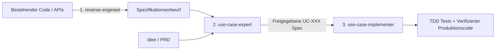

# Dominik's Skill Collection: Die Use-Case-Triade

[](LICENSE)
[]()
[]()

> **Deterministisches Requirements Engineering für KI-Coding-Agenten**  
> Ersetzt spekulative User Stories und ungenaue PRDs durch formale, testbare Use Cases nach Cockburn/RUP.

---

🌐 **Sprache / Language:** [🇬🇧 English](README.md) | [🇩🇪 Deutsch](README.de.md)

---

## ⚡ Das Problem: Warum KI-Agenten an User Stories scheitern

LLMs besitzen keine menschliche Intuition. Bei einer vagen Anforderung wie:
> *„Als Administrator möchte ich Benutzerprofile bearbeiten, damit die Kontodaten aktuell bleiben.“*

rät der Agent die Systemgrenzen, halluziniert Fehlerbehandlungen, übersieht Authentifizierungs-Invarianten und schreibt oberflächliche Mocks.

**Die Use-Case-Triade** löst dieses Problem durch formale, mathematisch strukturierte Verhaltensverträge, die KI-Agenten deterministisch und ohne Drift umsetzen können.

---

## 🧩 Die drei Kern-Skills



1. **[`use-case-expert`](skills/requirements/use-case-expert/SKILL.md)**: Erstellt, interviewt und auditiert formale Use-Case-Spezifikationen (Akteure, Vorbedingungen, Standardablauf, Erweiterungen/Fehlerfälle und verifizierbare Zustandsgarantien).
2. **[`use-case-implementer`](skills/requirements/use-case-implementer/SKILL.md)**: Verwandelt freigegebene Spezifikationen in vollständige TDD-Suiten und vertikale Produktions-Slices ohne spekulativen Overhead.
3. **[`use-case-reverse-engineer`](skills/requirements/use-case-reverse-engineer/SKILL.md)**: Analysiert bestehende Codebasen und rekonstruiert den impliziten Verhaltensvertrag als formale Use Cases.

---

## 🚀 Schnellstart & Installation

### Für Google Antigravity
Klonen oder kopieren Sie die Skills in Ihren Antigravity-Workspace oder in Ihr Konfigurationsverzeichnis:
```powershell
# Im Root-Verzeichnis Ihres Antigravity-Projekts
git clone https://github.com/dominikenkelmann/skills.git .agents/skills/dominiks-skills
```
Oder kopieren Sie einzelne Skill-Ordner direkt in `.agents/skills/`.

### Für Claude Code / KI-Agenten
Legen Sie die Skill-Verzeichnisse in das Skill-Verzeichnis Ihres Agenten:
```text
.claude/skills/
  ├── use-case-expert/
  ├── use-case-implementer/
  └── use-case-reverse-engineer/
```

---

## 📚 Dokumentation & Bedienungsanleitungen

| Anleitung | Beschreibung | Sprache |
| --- | --- | --- |
| 🇩🇪 [Dokumentations-Übersicht](docs/requirements/de/README.md) | Gesamte Architektur & Triade-Workflow | 🇩🇪 Deutsch |
| 🇩🇪 [use-case-expert Anleitung](docs/requirements/de/use-case-expert.md) | Spezifikationen erstellen & auditieren | 🇩🇪 Deutsch |
| 🇩🇪 [use-case-implementer Anleitung](docs/requirements/de/use-case-implementer.md) | TDD-Umsetzung & Verifikation | 🇩🇪 Deutsch |
| 🇩🇪 [use-case-reverse-engineer Anleitung](docs/requirements/de/use-case-reverse-engineer.md) | Code analysieren & Spezifikationen rekonstruieren | 🇩🇪 Deutsch |
| 🇬🇧 [English Usage Guide](docs/usage-guide.md) | Triad overview & workflow | 🇬🇧 English |
| 🇬🇧 [use-case-expert (EN)](docs/requirements/use-case-expert.md) | Authoring & auditing specs | 🇬🇧 English |
| 🇬🇧 [use-case-implementer (EN)](docs/requirements/use-case-implementer.md) | TDD implementation & vertical slices | 🇬🇧 English |
| 🇬🇧 [use-case-reverse-engineer (EN)](docs/requirements/use-case-reverse-engineer.md) | Extracting specs from existing code | 🇬🇧 English |

---

## 📄 Lizenz

Dieses Projekt ist unter der MIT-Lizenz lizenziert — siehe [LICENSE](LICENSE) für Details.
