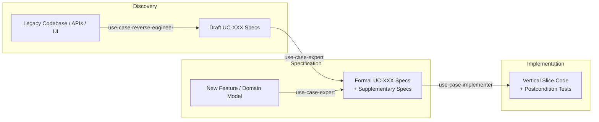

# Use Case Skills for AI Coding Agents

> **Deterministic software engineering for Claude Code, Codex, Antigravity, and AI coding agents.**  
> Move beyond vague user stories and PRD drift with formal use cases, vertical slices, and verifiable postconditions.

---

## ⚡ 30-Second Quickstart

Copy the skills directly into your workspace's `.agents/skills/` directory:

```bash
# Clone the repository
git clone https://github.com/dominikenkelmann/skills.git

# Copy all use case skills into your active workspace
mkdir -p .agents/skills
cp -r skills/skills/requirements/* .agents/skills/
```

For **Antigravity IDE** or **Claude Code**, the skills are automatically discovered once placed inside `.agents/skills/` or your global customization folder (`~/.gemini/config/skills/`).

---

## 🧩 The Use Case Skills Triad

| Skill | Category | Description | Direct Link |
|---|---|---|---|
| **`use-case-expert`** | `requirements` | Authors, de-vagues, and formalizes UC-XXX specifications & supplementary NFRs using strict templates and THAT formulas. | [SKILL.md](./skills/requirements/use-case-expert/SKILL.md) |
| **`use-case-implementer`** | `requirements` | Translates formal use case specs into domain-driven vertical slices, guard clauses, and test assertions mapped to postconditions. | [SKILL.md](./skills/requirements/use-case-implementer/SKILL.md) |
| **`use-case-reverse-engineer`** | `requirements` | Discovers and extracts formal UC-XXX specifications and boundary flows from legacy codebases, APIs, and UI routes. | [SKILL.md](./skills/requirements/use-case-reverse-engineer/SKILL.md) |

---

## 🔄 The Workflow: How They Compose



---

## 💡 Why These Skills Exist

### The Problem: "Vibe Coding" & The Vague Story Breakdown

Most failures with AI coding agents (Claude Code, Codex, Antigravity) are not code syntax errors — **they are communication breakdowns**:

> *"The User Story was simple: 'As an admin, I want to manage users.' The agent produced 800 lines of code, hallucinated an edit modal, missed 3 database constraints, and bypassed the session auth check."*

When agents receive loose user stories or rambling PRDs:
1. **They guess the happy path** and invent non-standard boundaries.
2. **They omit alternative flows** (error handling, validation rejections, rollbacks).
3. **They write tests for implementation details** rather than verifiable state changes.

### The Solution: Formal Use Cases as Agent Guardrails

Formal Use Cases (Alistair Cockburn / RUP methodology) are the single most effective specification format for Large Language Models because they enforce:

- **Strict Preconditions (`PRE1...`)**: Unambiguous entry guards and session requirements.
- **Atomic Alternating Steps**: Step 1 Actor $\rightarrow$ Step 2 System $\rightarrow$ Step 3 Actor. No conversational ambiguity.
- **The THAT Formula**: *"The system checks THAT [condition] is true"* with explicit alternative flows for every failure.
- **Verifiable Postconditions (`POST1...`)**: Explicit persistent data mutations that map 1:1 to automated test assertions.

---

## 📖 Methodology & Reference Assets

The `use-case-expert` skill includes a production-tested reference library in [`skills/requirements/use-case-expert/references/`](./skills/requirements/use-case-expert/references/):

- **[`use-case-template.md`](./skills/requirements/use-case-expert/references/use-case-template.md)** — The standardized Markdown template for UC-XXX specifications.
- **[`supplementary-specification-template.md`](./skills/requirements/use-case-expert/references/supplementary-specification-template.md)** — Template for cross-cutting non-functional requirements (NFRs).
- **[`ui-sketch-guide.md`](./skills/requirements/use-case-expert/references/ui-sketch-guide.md)** — Rules for ASCII/structured UI element representations and control alignments.
- **[`vague-terms.md`](./skills/requirements/use-case-expert/references/vague-terms.md)** — Automated de-vagueing dictionary replacing fuzzy phrasing (*"fast"*, *"secure"*, *"user-friendly"*) with testable criteria.

---

## 👥 Author & License

Created by **Dominik Enkelmann**.

Licensed under the [MIT License](./LICENSE). Feel free to adapt, hack, and compose these skills in your own agent setups.
