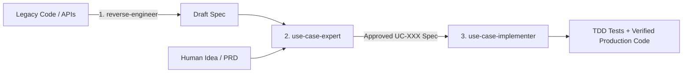

# Dominik's Skill Collection: The Use Case Triad

[](LICENSE)
[]()
[]()

> **Deterministic Requirements Engineering for AI Coding Agents**  
> Replace speculative user stories and rambling PRDs with formal, testable Cockburn/RUP Use Cases.

---

🌐 **Language / Sprache:** [🇬🇧 English](README.md) | [🇩🇪 Deutsch](docs/requirements/de/README.md)

---

## ⚡ The Problem: Why AI Agents Hallucinate on User Stories

LLMs do not have human intuition. When given a vague requirement like:
> *"As an admin, I want to edit user profiles so that account details stay up to date."*

The agent guesses the boundaries, hallucinates error handling, misses auth invariants, and writes shallow mocks. 

**The Use Case Triad** fixes this by providing formal, mathematically structured behavioral contracts that AI agents can execute deterministically without drifting.

---

## 🧩 The Three Skills



1. **[`use-case-expert`](skills/requirements/use-case-expert/SKILL.md)**: Authors, interviews, and audits formal Use Case specifications (Actors, Preconditions, Main Success Scenario, Extensions, and Verifiable Postconditions).
2. **[`use-case-implementer`](skills/requirements/use-case-implementer/SKILL.md)**: Turns approved specs into complete TDD suites and vertical production slices with zero speculative bloat.
3. **[`use-case-reverse-engineer`](skills/requirements/use-case-reverse-engineer/SKILL.md)**: Scans legacy codebases and extracts the hidden behavioral contract as formal Use Cases.

---

## 🚀 Quick Start & Installation

### For Google Antigravity
Clone or copy the skills into your Antigravity workspace or global configuration directory:
```powershell
# In your Antigravity project root
git clone https://github.com/dominikenkelmann/skills.git .agents/skills/dominiks-skills
```
Or copy individual skill folders directly into `.agents/skills/`.

### For Claude Code / AI Agents
Place the skill directories into your agent's skill directory:
```text
.claude/skills/
  ├── use-case-expert/
  ├── use-case-implementer/
  └── use-case-reverse-engineer/
```

---

## 📚 Documentation & Guides

| Guide | Description | Language |
| --- | --- | --- |
| 📖 [Usage Guide](docs/usage-guide.md) | Triad overview and end-to-end workflow walkthrough | 🇬🇧 English |
| 📖 [use-case-expert Guide](docs/requirements/use-case-expert.md) | Authoring & auditing formal Use Case specifications | 🇬🇧 English |
| 📖 [use-case-implementer Guide](docs/requirements/use-case-implementer.md) | TDD implementation & vertical slices | 🇬🇧 English |
| 📖 [use-case-reverse-engineer Guide](docs/requirements/use-case-reverse-engineer.md) | Reconstructing contracts from existing code | 🇬🇧 English |
| 🇩🇪 [Deutsche Dokumentation](docs/requirements/de/README.md) | Vollständige Dokumentationsübersicht | 🇩🇪 Deutsch |
| 🇩🇪 [use-case-expert (DE)](docs/requirements/de/use-case-expert.md) | Spezifikationen erstellen & auditieren | 🇩🇪 Deutsch |
| 🇩🇪 [use-case-implementer (DE)](docs/requirements/de/use-case-implementer.md) | TDD-Umsetzung & Verifikation | 🇩🇪 Deutsch |
| 🇩🇪 [use-case-reverse-engineer (DE)](docs/requirements/de/use-case-reverse-engineer.md) | Code analysieren & Spezifikationen rekonstruieren | 🇩🇪 Deutsch |

---

## 📄 License

This project is licensed under the MIT License — see the [LICENSE](LICENSE) file for details.
