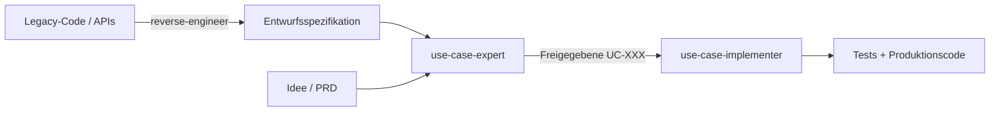

# Die Use-Case-Triade

Ein geschlossener Requirements-Engineering-Kreislauf für KI-Coding-Agenten. Ersetzt spekulative User Stories und vage PRDs durch formale, testbare Use Cases nach Cockburn/RUP.

Drei Skills greifen ineinander:

1. **`use-case-expert`** — verfasst und prüft formale Use-Case-Spezifikationen.
2. **`use-case-implementer`** — erzeugt TDD-Testsuiten und Vertical Slices aus freigegebenen Spezifikationen.
3. **`use-case-reverse-engineer`** — extrahiert formale Use Cases aus bestehendem Quellcode.

## Welcher Skill, wann

| Ausgangslage | Skill | Was passiert |
| --- | --- | --- |
| Neues Feature oder neue Idee | `use-case-expert` | Befragt dich systematisch, definiert Vorbedingungen, alternierende Schritte, Erweiterungen und Zustandsgarantien. |
| Freigegebene Spezifikation steht | `use-case-implementer` | Schreibt erst fehlschlagende Tests für jeden Ablauf, dann den Code, der sie erfüllt. |
| Legacy-Code braucht Dokumentation | `use-case-reverse-engineer` | Liest den Code und rekonstruiert den verborgenen Kontrakt als formalen Use Case. |
| Produktionsfehler ohne Spec-Abdeckung | `use-case-expert` → `use-case-implementer` | Ergänzt den Fehler als Extension-Branch, erzeugt den Regressionstest, behebt den Bug. |

## Detaillierte Dokumentation

- 📖 [use-case-expert](use-case-expert.md)
- 📖 [use-case-implementer](use-case-implementer.md)
- 📖 [use-case-reverse-engineer](use-case-reverse-engineer.md)
- 🇬🇧 [English Documentation](../) — Full documentation in English
