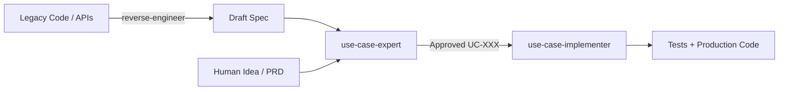

# The Use Case Triad

A closed-loop requirements engineering system for AI coding agents. It replaces speculative user stories and vague PRDs with formal, testable Cockburn/RUP Use Cases.

Three skills work in lockstep:

1. **`use-case-expert`** — authors and audits formal Use Case specifications.
2. **`use-case-implementer`** — builds TDD test suites and vertical slices against approved specs.
3. **`use-case-reverse-engineer`** — extracts formal Use Cases from existing code.

## Which skill, when

| Situation | Skill | What happens |
| --- | --- | --- |
| New feature or idea | `use-case-expert` | Interviews you, defines preconditions, alternating steps, extensions, and state postconditions. |
| Approved spec ready to build | `use-case-implementer` | Writes failing tests for every flow, then writes code to satisfy them. |
| Legacy code needs documenting | `use-case-reverse-engineer` | Reads the code and reconstructs the hidden contract as a formal Use Case. |
| Production bug without spec coverage | `use-case-expert` → `use-case-implementer` | Adds the failure as an Extension branch, generates the regression test, fixes the code. |

## Detailed documentation

- 📖 [use-case-expert](docs/requirements/use-case-expert.md)
- 📖 [use-case-implementer](docs/requirements/use-case-implementer.md)
- 📖 [use-case-reverse-engineer](docs/requirements/use-case-reverse-engineer.md)
- 🇩🇪 [Deutsche Dokumentation](docs/requirements/de/) — Vollständige Anleitung auf Deutsch
