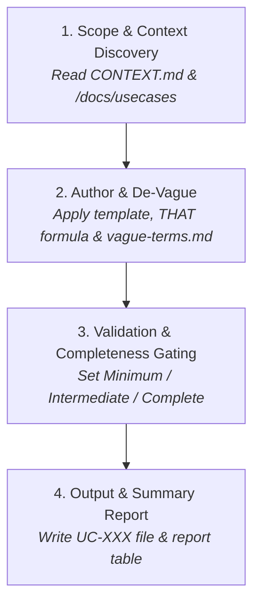

# Use Case & Requirements Expert

Specialist in formal, deterministic Use Case Specifications (UC-XXX) and Supplementary Specifications.

Use cases bridge the communication gap between human domain experts and AI coding agents. Unlike conversational user stories or rambling PRDs, a formal use case provides the exact mathematical boundary conditions an LLM needs to produce bug-free, testable code.

This skill is informed by the project's domain model (`CONTEXT.md`) and enforces a strict, ambiguity-free specification standard.

---

## 🎯 When to Use This Skill

Invoke or trigger this skill whenever you need to:
- **Author a new Use Case** from a feature request, user story, or idea.
- **Refine / De-vague an existing Use Case** by replacing fuzzy phrasing with quantifiable parameters.
- **Convert a loose PRD or functional requirement document** into structured `UC-XXX` specifications.
- **Review and formalize requirements** to check for missing error branches, vague terms, or unverified postconditions.

### Example Prompts:
- *"Author a formal use case for customer checkout with credit card and PayPal."*
- *"Review `/docs/usecases/UC-001 Register User.md` and remove all vague terms."*
- *"Convert these 3 user stories into formal UC-XXX specifications."*

---

## 📚 Reference Library

This skill strictly adheres to the templates and guides in [`references/`](./references/):

| Topic | Reference Document | Purpose |
|---|---|---|
| **Use Case Template** | [`references/use-case-template.md`](./references/use-case-template.md) | The canonical Markdown structure for every `UC-XXX` file. |
| **Supplementary Specs** | [`references/supplementary-specification-template.md`](./references/supplementary-specification-template.md) | Template for cross-cutting non-functional requirements (NFRs). |
| **UI Sketch Guide** | [`references/ui-sketch-guide.md`](./references/ui-sketch-guide.md) | Structured, text-based UI layout and control notations. |
| **Vague Terms Dictionary** | [`references/vague-terms.md`](./references/vague-terms.md) | Anti-patterns and exact replacement fix patterns for fuzzy language. |
| **Domain Glossary** | `CONTEXT.md` (root directory, if present) | Ubiquitous language and domain model definitions. |

---

## ⚡ Critical Invariants (Non-Negotiable Rules)

1. **Domain Language Consistency**: When `CONTEXT.md` exists, strictly adhere to its ubiquitous language, entity names, and concepts. Never invent synonyms or alter established domain terminology.
2. **Decisive Phrasing**: Never present alternatives in text (e.g. BAD: `'labeled "Display" or "View Type"'`). Make an educated decision (GOOD: `'labeled "View Type"'`).
3. **Field & Element Notation**: Enclose data field names, badges, and controls in square brackets, e.g. `[Email Address]`, `[Submit Button]`, `[Status Badge]`.
4. **PlantUML Boundary Ban**: Never draw a system boundary box (e.g. `rectangle "System" { ... }`) in use case diagrams. Keep diagrams actor-to-use-case clean.
5. **Cross-Use-Case Flow Boundaries**: Never jump, branch, or link to other use cases inside basic or alternative flows, except for an explicit invocation of an included use case: `The system invokes UC-XXX Name (operational need)`.
6. **Check Formulation (The THAT Formula)**: Always write checks as *"The system checks that [condition] is true"*. Never write *"The system checks IF..."*. Always supply an explicit Alternative Flow handling the failed check.
7. **Zero Vague Terms**: Scan every testable statement against `references/vague-terms.md` and rewrite flagged terms with their documented fix pattern.
8. **Fact Integrity**: Never invent facts. When details are missing, record them explicitly in the `## Open Items` section.

---

## 🔄 Step-by-Step Process

### Step 1: Discover Scope & Context
- Default target directory: `/docs/usecases/` (or the directory specified by the user).
- Check for `CONTEXT.md` in the project root. If found, load all domain terminology, entity names, and state definitions.
- Check existing use case files to determine the next available ID sequence (e.g. `UC-001`, `UC-002`, `UC-003`... zero-padded to 3 digits).

### Step 2: Author, Refine & De-Vague
Draft the specification using [`references/use-case-template.md`](./references/use-case-template.md):
- **Naming**: File named `UC-XXX Verb Noun.md` (e.g. `UC-001 Register User.md`).
- **Brief Description**: 1–2 sentences: *"[Actor] wants to [goal] in order to [benefit]."* Executive overview, not a CRUD list.
- **Local View (PlantUML)**: `left to right direction`. Originating actors (left) $\rightarrow$ Included use cases (center) $\rightarrow$ Current use case (right) $\rightarrow$ Secondary actors (far right).
- **Preconditions (`PRE1, PRE2...`)**: Testable state assertions required before the trigger.
- **Trigger**: Initiating event and actor. Never duplicate the trigger as Step 1 of the basic flow.
- **Basic Flow**: Alternating atomic actor and system steps. Apply the **THAT formula** for all validations.
- **Alternative Flows**: Numbered branches (e.g. `2.1 Invalid Email`). Must declare divergence point, condition, recovery steps, and resumption point (`Resume at: Step N` or `The use case ends.`).
- **Postconditions (`POST1, POST2...`)**: Distinguish Success state changes from Failure rollback state changes.
- **Data Requirements**: Table of fields exchanged (`Data Item`, `Source / Target`, `Data Dictionary Ref`, `Notes`).
- **UI Sketch**: Structured UI elements in square brackets, with field types, placeholders, and dynamic rules (follow [`references/ui-sketch-guide.md`](./references/ui-sketch-guide.md)).
- **De-vagueing Pass**: Run every statement against [`references/vague-terms.md`](./references/vague-terms.md) and replace fuzzy words with quantitative criteria.

### Step 3: Validate Completeness
Assign the frontmatter `completeness` level:
- `Minimum`: Contains any open items or unconfirmed assumptions.
- `Intermediate`: All sections filled and de-vagueing passed; awaiting human sign-off.
- `Complete`: Reviewed and approved by the human domain expert.

### Step 4: Output & Summary Report
- **Single Use Case**: Write the target file directly to `/docs/usecases/UC-XXX Verb Noun.md`.
- **Batch Processing**: When migrating or reviewing multiple use cases, output a clean summary table:

| Source File | UC-ID | New Filename | Completeness | Open Items | Notes |
|---|---|---|---|---|---|
| `rough-login.md` | UC-001 | `UC-001 Authenticate User.md` | Intermediate | 0 | Cleaned 4 vague terms |
| `rough-checkout.md` | UC-002 | `UC-002 Process Order Checkout.md` | Minimum | 1 | Open item: payment gateway SLA |
