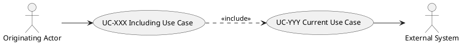

# UC-XXX: [Use Case Name]

## 1. Brief description

{Write 1-2 sentences overview (hard limit 3). State high-level goal, do not list single CRUD operations.}

### Open Items

{Omit this entire subsection if there are no open items.}

## 2. Local View 

## 3. Actors

| Actor | Description |
|-------|-------------|
| User  | {Only the initiating / triggering actor of this use case} |

### Triggering use cases

{remove section if not applicable}

| Use Case Name | Need |
|-------|-------------|
| UC-123  | When a document needs to be encoded |

## 4. Preconditions

| #    | Precondition                                           |
| ---- | ------------------------------------------------------ |
| PRE1 | {e.g. "User is authenticated and has role `MANAGER`."} |
| PRE2 | {e.g. "The target entity exists in the database."}     |

---

## 5. Trigger

{name the event that triggers this use case or indicate the use cases that include this one.}

## 6. Basic Flow

1. The user {does something - e.g., provides [Email] and [Password]}.
2. The system {displays/does something - e.g., validates the credentials against Special Requirements SR-XXX}.
3. The user {does something - e.g., selects the 'Login' action}.
4. The system {displays/does something - e.g., authenticates the user and redirects to the [Dashboard]}.
5. The use case ends.

## 7. Alternative Flows

### 7.1 {Alternative Flow Name}

- **Divergence Point:** Step {N} of Basic Flow.
- **Condition:** {e.g., User selects 'Cancel' instead of 'Submit'}

1. The user {does something}.
2. The system {displays/does something}.
3. Resume at: Step {M} / The use case ends.

### 7.2 {Another Alternative Flow}

- **Divergence Point:** Step {N} of Basic Flow.
- **Condition:** {…}

1. The user {does something}.
2. The system {displays/does something}.
3. Resume at: Step {M} / The use case ends.

## 8. Postconditions

### Success Postconditions

| #     | Postcondition                                            |
| ----- | -------------------------------------------------------- |
| POST1 | {e.g. "A new record is persisted with status `ACTIVE`."} |
| POST2 | {e.g. "An email confirmation is queued for delivery."}   |

### Failure Postconditions

| #     | Postcondition                                            |
| ----- | -------------------------------------------------------- |
| POST3 | {e.g. "Database error. No data changed."} |

## 9. UI Sketch

{For multi-panel screens or cockpits, see `references/ui-sketch-guide.md` for layout overview diagrams, panel overview tables, and structured panel-by-panel breakdown.}

#### [UI Name]

**Fields**

- {e.g. "[Name] text input, [Email] text input, [Role] dropdown"}

**Active elements**

- {e.g. "Submit button, Cancel button, Visibility toggle"}

**UI functional requirements**

- {e.g. "Submit button disabled until all required fields are valid"}

#### [Another UI Name]

## 10. Special Requirements

#### 10.1 Performance

{e.g. "Response within 200ms for 95th percentile"}

#### 10.2 Concurrency

{e.g. "Must handle optimistic locking for concurrent edits"}

#### 10.3 Data Volume

{e.g. "Must support batch input of up to 10,000 records"}

## 11. Data Requirements

See [Data Dictionary](specs/data-dictionary.dbml) for detailed field specifications.

| Data Item | Source / Target | Reference (Data Dictionary) | Notes                             |
| --------- | --------------- | --------------------------- | --------------------------------- |
| [Field]   | Input           | `Entity.Field`              | {e.g. "User's primary email"}     |
| [Field]   | Output          | `Entity.Field`              | {e.g. "Generated transaction ID"} |
| {Entity}  | Domain          | `Entity`                    | {e.g. "User profile record"}      |

## 12. API Contract

{reference used api calls from the api reference document.}
