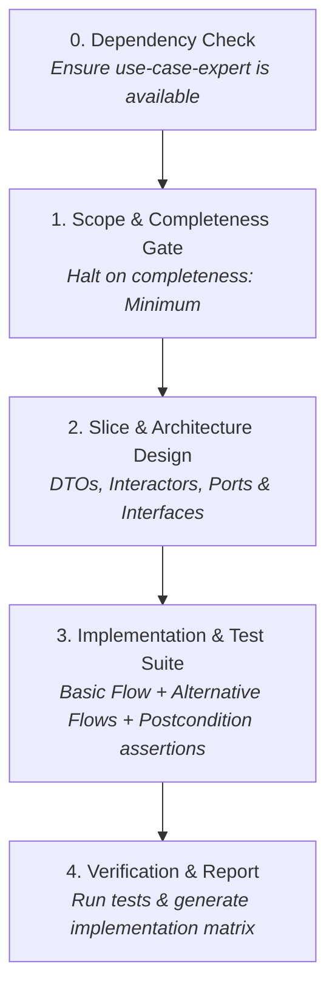

# Use Case Implementer

Translates formal Use Case Specifications (`UC-XXX`) and Supplementary Specifications into clean, well-tested, domain-driven code.

Where traditional coding agents scatter implementation logic across controllers and database models, `use-case-implementer` constructs **domain-driven vertical slices** directly traced to specification steps, with automated test assertions mapped 1:1 to postconditions.

> [!IMPORTANT]
> **Dependency on `use-case-expert`**: This skill implements specifications authored according to `use-case-expert` standards. It relies on `use-case-expert` for specification templates, completeness lifecycle (`Minimum` | `Intermediate` | `Complete`), section conventions, and domain glossary alignment (`CONTEXT.md`).

---

## 🎯 When to Use This Skill

Invoke or trigger this skill whenever you want an agent to:
- **Implement a new feature** defined in a `UC-XXX` specification file.
- **Scaffold domain interactors / handlers** that cleanly separate transport, business rules, and persistence.
- **Generate comprehensive test suites** covering all happy path steps (`Basic Flow`) and branch rejections (`Alternative Flows`).
- **Verify test coverage against postconditions** (`POST1, POST2...`).

### Example Prompts:
- *"Implement `/docs/usecases/UC-001 Register User.md` as a clean vertical slice with tests."*
- *"Scaffold the interactor and validation schemas for UC-042."*
- *"Verify that our auth handlers cover all alternative flows defined in UC-001."*

---

## 🧩 Specification-to-Code Mapping Matrix

Every section of the `UC-XXX` document maps to a concrete software engineering construct:

| Specification Section | Code Target (Clean Slice) | Verification / Test Focus |
|---|---|---|
| **Preconditions (`PRE1...`)** | Route guards, auth checks, session guards, precondition assertions | Guard rejections & unauthorized access paths |
| **Basic Flow** | Use case interactor / handler happy path; atomic step execution | Happy-path end-to-end / unit flow execution |
| **Alternative Flows** | Branching conditions, domain error handlers, recovery logic | Negative test case per alternative flow condition |
| **Included Use Cases** | Invocations of included use-case interactors / services | Dependency call verification & mock integration |
| **Postconditions (`POST1...`)** | DB mutations, state changes, emitted domain events | Primary test assertions for persisted state & output |
| **Data Requirements** | Domain entities, DTOs, schemas (e.g. Zod, Joi, TypeScript types) | Schema boundary and data validation tests |
| **UI Sketch & Requirements** | UI components, form inputs, action controls, dynamic visibility | Component rendering & interaction assertions |
| **Special Requirements** | Rate limiters, concurrency controls, timeout limits, encryption | Non-functional / integration checks |
| **API Contract** | Route declarations, HTTP verbs, response status codes, payloads | API contract & integration tests |

---

## 🔄 Step-by-Step Process

### Step 0: Hard Dependency Check
Verify that `use-case-expert` is available in your agent environment. If missing, halt execution and request it.

### Step 1: Scope Discovery & Completeness Gate
- Locate target use case files in `/docs/usecases/` (or user-specified path).
- **Check Frontmatter Completeness**:
  - `completeness: Minimum`: **HALT.** Inform the user that the specification has open items and advise refining it via `use-case-expert` before writing code.
  - `completeness: Intermediate` or `Complete`: Proceed with implementation.

### Step 2: Architecture & Slice Design
Design a decoupled vertical slice:
1. **Input/Output DTOs & Validation**: Schemas derived from **Data Requirements**.
2. **Use Case Interactor / Handler**: Encapsulates the business logic of the **Basic Flow** and branches into **Alternative Flows**.
3. **Ports / Repositories**: Define interfaces for persistence or external APIs so domain logic remains decoupled from frameworks.

### Step 3: Implementation & Pluggable Testing
- Implement the slice following ubiquitous language from `CONTEXT.md`.
- Implement unit and integration tests covering:
  - Every step in the **Basic Flow**.
  - Every negative condition in the **Alternative Flows**.
  - **Success Postconditions (`POST1`)**: Assert persisted database changes, events, and response values.
  - **Failure Postconditions (`POST2`)**: Assert rollbacks, error codes, and that no invalid state was saved.

### Step 4: Implementation Report
On completion, generate a clean summary table:

| Use Case | Files Created / Modified | Tests | Flows Covered | Open Issues |
|---|---|---|---|---|
| `UC-001 Register User` | `auth/registerUser.ts`, `auth/registerUser.test.ts` | 4 | Basic + AF 2.1, 2.2, 6.1 | — |
| `UC-002 Lock Account` | `auth/lockAccount.ts`, `auth/lockAccount.test.ts` | 2 | Basic + AF 3.1 | — |
