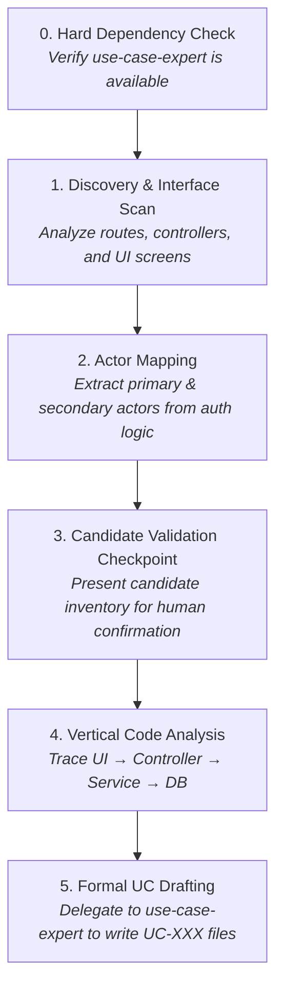

# Use Case Reverse Engineer

Discovers, extracts, and reverse-engineers formal Use Case Specifications (`UC-XXX`) and Supplementary Specifications from existing codebases, UI components, and API definitions.

When joining a legacy project or maintaining an undocumented codebase, developers and AI agents often struggle with fragmented logic scattered across routes, middleware, and database models. `use-case-reverse-engineer` scans your codebase's external interfaces, consolidates CRUD endpoints into cohesive functional use cases, and generates formal `UC-XXX` specifications.

> [!IMPORTANT]
> **Strict Dependency on `use-case-expert`**: This skill specializes strictly in codebase discovery, boundary extraction, and code-to-use-case tracing. It delegates entirely to `use-case-expert` for specification templates, structural invariants, PlantUML diagrams, and de-vagueing checks.

---

## 🎯 When to Use This Skill

Invoke or trigger this skill whenever you need to:
- **Document an existing or legacy codebase** without having prior requirements documentation.
- **Extract use cases from REST/GraphQL APIs**, UI router tables, or page controllers.
- **Establish a formal baseline before refactoring** or migrating an application.
- **Map existing code logic back into formal business requirements**.

### Example Prompts:
- *"Reverse-engineer the user management routes into formal UC-XXX specifications."*
- *"Scan our `/api/v1/billing` endpoints and generate use cases in `/docs/usecases/`."*
- *"Extract a formal use case for the checkout flow from our React checkout component and backend controllers."*

---

## 🧠 Core Principles

1. **Interface-Driven Discovery & CRUD Consolidation**
   - **Menu Entries & UI Navigation**: Top-level navigation nodes or user views map directly to primary use cases.
   - **Multi-Step Wizards**: A multi-step flow maps to a single consolidated use case.
   - **REST CRUD Consolidation**: Consolidate cohesive CRUD endpoints operating on the same resource (e.g. `GET`, `POST`, `PUT`, `DELETE /api/v1/users`) into a single comprehensive use case (e.g., `UC-001 Manage Users`), using user choices and alternative flows to model individual actions.
2. **User-Centric & Tier-Agnostic Perspective**
   - Describe system behavior strictly from the user's perspective across the full vertical slice. Never write separate frontend vs. backend use cases.
3. **Code-to-Specification Mapping Matrix**
   - Routes/Controllers $\rightarrow$ **Basic Flow**
   - Error catches / schema validation / 4xx/5xx responses $\rightarrow$ **Alternative Flows**
   - Auth guards & JWT validation $\rightarrow$ **Preconditions (`PRE1...`)**
   - Database mutations & emitted events $\rightarrow$ **Postconditions (`POST1...`)**
   - Request DTOs & DB models $\rightarrow$ **Data Requirements**
   - UI templates / JSX / form fields $\rightarrow$ **UI Sketch**

---

## 🔄 Step-by-Step Process

### Step 0: Dependency Verification
Confirm availability of `use-case-expert`. If missing, halt execution and prompt the user.

### Step 1: Discovery & Interface Scan
- Scan the target codebase for entry points: routes, controllers, RPC handlers, and UI navigation trees.
- Cluster related endpoints into candidate use case boundaries.

### Step 2: Actor Mapping
- Identify primary triggering actors (e.g. `Customer`, `Administrator`, `Authenticated User`) from role guards and session middlewares.
- Identify secondary system actors (e.g. `Payment Gateway`, `Email Service`) from outbound API clients and webhooks.

### Step 3: User Validation Checkpoint (Interactive Gate)
Before writing specifications, present the candidate inventory table to the user for sign-off:

| Candidate UC | Goal | Interface / Endpoints | Type | Consolidated Endpoints |
|---|---|---|---|---|
| `UC-001 Manage Users` | Administer user accounts | `/api/v1/users`, `/users` UI | Primary | `GET/POST/PUT/DELETE /api/v1/users` |
| `UC-002 Process Payroll` | Execute monthly salary run | `POST /api/v1/payroll/process` | Primary | `POST /api/v1/payroll/process` |

*Wait for user confirmation on boundaries and naming before proceeding.*

### Step 4: Vertical Code Analysis
Trace execution from controller entry, down through domain services, to persistence mutations and error handling.

### Step 5: Inline Specification Drafting
Delegate to `use-case-expert` to generate complete, de-vagued Markdown files in `/docs/usecases/UC-XXX Verb Noun.md`.
